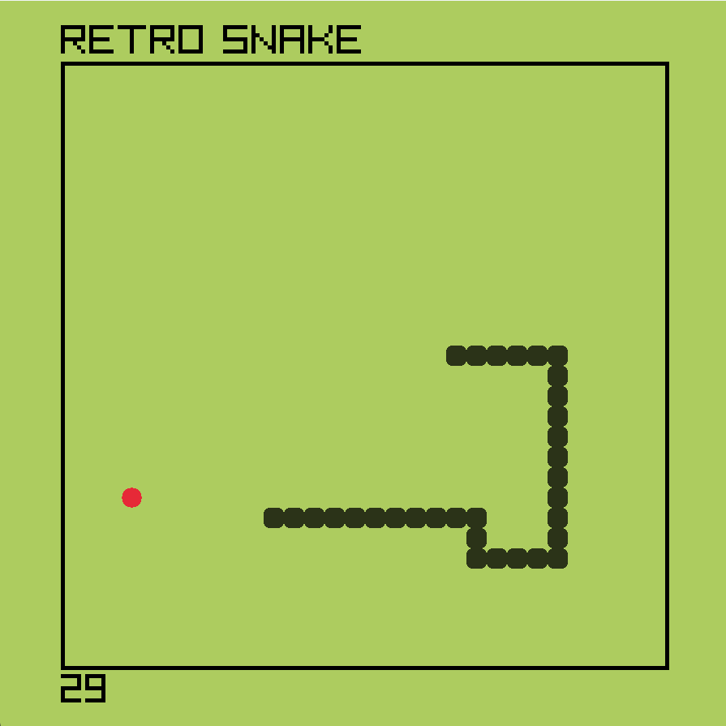
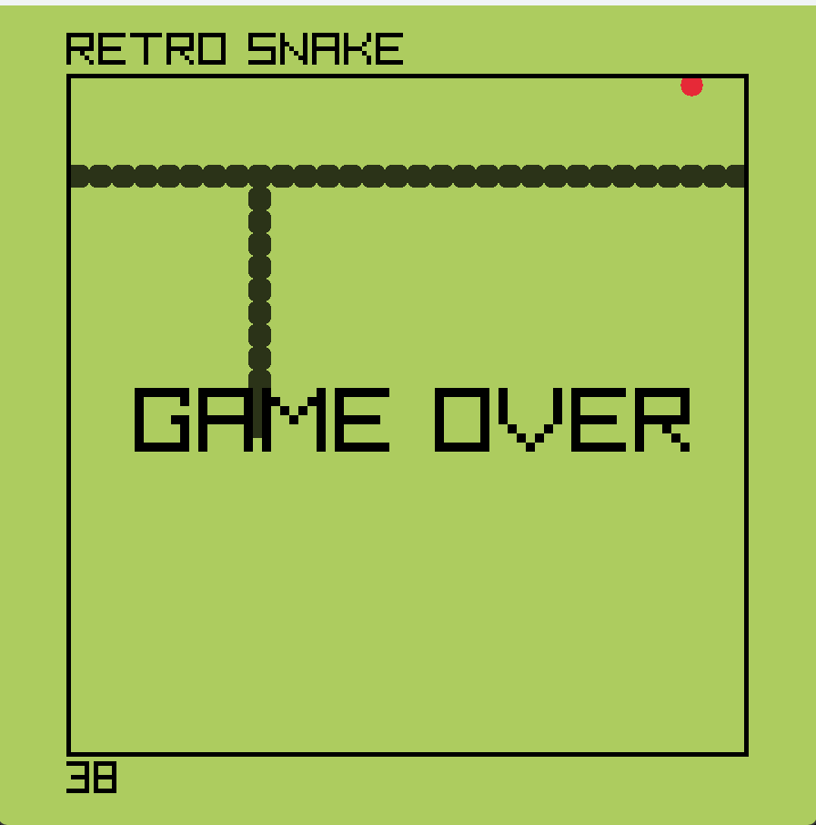

# 🐍 Snake Game — C++ & Raylib


A classic Snake game built from scratch in **C++** using the **Raylib** graphics library. The snake's body is managed using a custom linked list — no arrays, no vectors, just raw pointers and nodes.

One thing I liked about this project: instead of dying at the walls, the snake wraps around to the other side. Feels much better to play.

---

## 🚀 Features

- 🐍 Snake body built using a **custom linked list** (Node struct with raw pointers)
- 🍎 Food rendered as a custom PNG texture via Raylib
- 🔄 Wall wrapping — snake teleports through boundaries instead of dying
- 💥 Self-collision detection — hitting your own body ends the game
- 🏆 Score tracking — increases each time food is eaten
- 💀 Game over screen on self-collision
- ⚡ Smooth 60 FPS with timer-based movement speed

---

## 🧠 Design & Data Structure

| Concept | How I Applied It |
|:--------|:----------------|
| **Linked List** | Snake body is a chain of `Node` structs — new head added on move, tail removed |
| **Classes** | `Snake` handles movement and rendering, `Food` handles spawning and texture |
| **Encapsulation** | Direction state and body logic are fully contained inside `Snake` |
| **Dynamic Memory** | Nodes are heap-allocated with `new` and freed with `delete` on tail removal |
| **Collision Detection** | Self-collision checked by traversing the full linked list each frame |

### How the Snake Moves

```
Every tick:
  AddHead()      → new Node created at front with updated position
  removeTail()   → last Node deleted from the back
  ate food?      → tail NOT removed → snake grows by 1
```

### Class Structure

```
Snake
├── Node* head        → front of the linked list
├── Node* tail        → back of the linked list
├── AddHead()         → moves snake forward
├── removeTail()      → shrinks body when no food eaten
└── Draw()            → renders each node as a rounded rectangle

Food
├── Texture2D         → PNG image loaded via Raylib
├── GenerateRandomPos() → avoids spawning on snake body
└── Draw()            → renders food texture at grid position
```

---

## 📁 Project Structure

```
snake-game-cpp/
│
├── snake.cpp         # Full game — Snake and Food classes
├── food.png          # Food sprite
├── assets/
│   ├── gameplay.png  # Gameplay screenshot
│   └── gameover.png  # Game over screen
└── README.md
```

---

## 🎮 Controls

| Key | Action |
|:----|:-------|
| `W` or `↑` | Move up |
| `S` or `↓` | Move down |
| `A` or `←` | Move left |
| `D` or `→` | Move right |

## 📸 Screenshots

### Gameplay


### Game Over

---

## ⚙️ How to Run

**Requirements**
- G++ with C++17 support
- [Raylib 5.5](https://www.raylib.com/) installed
- Windows OS
- `food.png` in the same directory as the executable

**Compile & Run**
```bash
g++ -std=c++17 snake.cpp -o snake -I. -lraylib -lopengl32 -lgdi32 -lwinmm
./snake
```

**Using VS Code**
1. Open the project folder in VS Code
2. Press `Ctrl + Shift + B` to build
3. Press `F5` to run

---

## 👨‍💻 Developer

**Kartar Singh**
CS Student @ IBA Karachi
[github.com/kartar-singh-cs](https://github.com/kartar-singh-cs)

---

## 📌 Why I Built This

Snake seemed simple until I started building it. Managing the body as a linked list — adding a head, removing a tail, checking for self-collision by traversing every node — made me think carefully about pointer logic and dynamic memory in a way that textbook exercises never did. Small project, real lessons.
